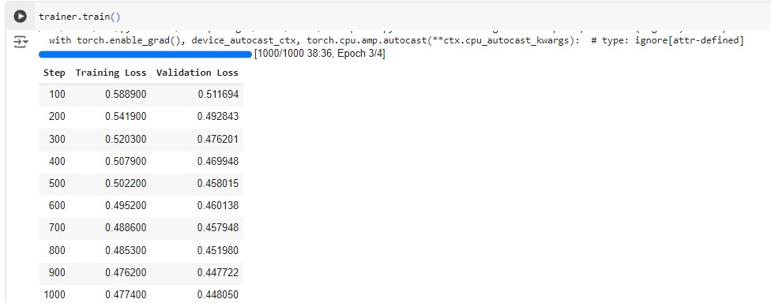

# TTS_English_Technical
Finetune speechT5 model on Technical Vocabulary

# Fine-tuning SpeechT5 for English Technical Text-to-Speech

This Colab notebook demonstrates how to fine-tune the SpeechT5 model for text-to-speech (TTS) on an English technical dataset.

## Dataset

The dataset used is "Yassmen/TTS_English_Technical_data" available on the Hugging Face Hub. It contains audio recordings and corresponding transcriptions of English technical content.

## Fine-tuning steps

1. **Install dependencies:** Install the necessary libraries using `pip install transformers datasets soundfile accelerate speechbrain==0.5.16`.

2. **Load dataset:** Load the dataset from the Hugging Face Hub using `load_dataset("Yassmen/TTS_English_Technical_data", split="train")`. 

3. **Preprocess data:**
    - Cast the audio column to the desired sampling rate (16kHz).
    - Extract vocabulary from the transcriptions.
    - Normalize the transcriptions by converting to lowercase, removing punctuation, and extra whitespace.
    - Create speaker embeddings using the `speechbrain/spkrec-xvect-voxceleb` model.
    - Prepare the dataset by encoding the text and audio, and adding speaker embeddings.
    - Filter out very long inputs.
    - Split the dataset into train and test sets.

4. **Create data collator:** Create a data collator to pad the inputs and labels to the maximum length in a batch.

5. **Load and configure model:** Load the `SpeechT5ForTextToSpeech` model from the `microsoft/speecht5_tts` checkpoint. 

6. **Set up training arguments:** Define the training arguments, including output directory, batch size, learning rate, etc. 

7. **Fine-tune the model:**
    - Create a `Seq2SeqTrainer` with the specified arguments and model.
    - Train the model using `trainer.train()`. 
    - Push the trained model to the Hugging Face Hub using `trainer.push_to_hub()`.
    - 

## Running the code

1. **Open the Colab notebook:** Click on the provided link to open the notebook in Google Colab.
2. **Set up environment:** Make sure you have a Google account and are logged in to Colab.
3. **Run all cells:** Execute all the code cells in the notebook sequentially.
4. **(Optional) Modify parameters:** You can modify the dataset, model checkpoint, training arguments, and other parameters as needed.
5. **(Optional) Save a copy:** Save a copy of the notebook to your Google Drive to preserve any changes you make.

This README provides a general overview of the code and steps involved. For more detailed information, please refer to the comments and documentation within the Colab notebook itself.
## 🔗 Links

You can find the colab notebbok and the github repository from the bellow Links.

